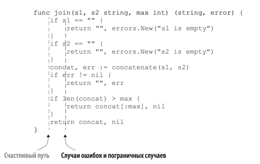

# ОШИБКА #2: ЛИШНИЙ ВЛОЖЕННЫЙ КОД

При написании кода важно не допускать сильной вложенности. Чем меньше вложенность кода, тем проще его понять.

Пример большой вложенности:
```go
func join1(s1, s2 string, max int) (string, error) {
    if s1 == "" {
        return "", errors.New("s1 is empty")
    } else {
        if s2 == "" {
            return "", errors.New("s2 is empty")
        } else {
            concat, err := concatenate(s1, s2)
            if err != nil {
                return "", err
            } else {
                if len(concat) > max {
                    return concat[:max], nil
                } else {
                    return concat, nil
                }
            }
	    }
    }
}

func concatenate(s1, s2 string) (string, error) {
	// ...
}
```

Код, представленный выше, можно переписать с меньшей вложенностью:
```go
func join(s1, s2 string, max int) (string, error) {
    if s1 == "" {
        return "", errors.New("s1 is empty")
    }
    if s2 == "" {
        return "", errors.New("s2 is empty")
    }
    concat, err := concatenate(s1, s2)
    if err != nil {
        return "", err
    }
    if len(concat) > max {
        return concat[:max], nil
    }
    return concat, nil
}

func concatenate(s1 string, s2 string) (string, error) {
// ...
}
```

В идеале код должен иметь 2 уровня: счастливый путь (без ошибок) и уровень с обработкой ошибок и пограничных случаев.  



### Рекомендации по уменьшению вложенности кода

* Когда происходит возврат из блока if, то можно опускать блок else.
```go
if foo() {
    // ...
    return true
}
// ...
```

* Обрабатывать заранее пусть с ошибками.
```go
if s != "" {
    // ...
} else {
    return errors.New("empty string")
}

// Меняем на:
if s == "" { 
    return errors.New("empty string")
}
// ...
```
