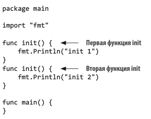

# ОШИБКА #3: НЕПРАВИЛЬНО ИСПОЛЬЗОВАТЬ ФУНКЦИЮ ИНИЦИАЛИЗАЦИИ

## Концепция

Функция инициализации (init) используется для инициализации состояния приложения. Она не имеет аргументов и не возвращает результата. 
Когда пакет инициализируется, оцениваются все объявления констант и переменных в пакете. Затем выполняются функции инициализации.
Функцию init нельзя напрямую вызвать в коде.


Если в программе есть функция init, и мы импортируем в программу пакет с init, то сначала будет выполнена функция init из пакета.


Можно определить несколько функций init для каждого пакета. В таком случае последовательность выполнения функции
внутри пакета задается алфавитным порядком исходных файлов. Например, если пакет содержит файл a.go и файл b.go и в обоих содержится функция
инициализации, то первой выполняется та из них, что находится в a.go.

Можно определить несколько функций init в одном исходном файле. Тогда они выполнятся по порядку.



Если нужно инициализировать пакет, но пакет в коде нигде не используется (иногда такое встречается на практике), 
можно использовать оператор _:

```go
package main
import (
    "fmt"
    _ "foo" // Пакет foo будет инициализирован перед выполнением функции main
)
func main() {
// ...
}
```


## Когда использовать функцию init

Функция init не возвращает никаких значений, поэтому ее лучше использовать в случаях, когда не нужно возвращать состояние 
и когда код не может вернуть ошибку. Например, в случае настройки статической конфигурации HTTP:

```go
func init() {
    redirect := func(w http.ResponseWriter, r *http.Request) {
        http.Redirect(w, r, "/", http.StatusFound)
    }
    http.HandleFunc("/blog", redirect)
    http.HandleFunc("/blog/", redirect)
	
    static := http.FileServer(http.Dir("static"))
    http.Handle("/favicon.ico", static)
    http.Handle("/fonts.css", static)
    http.Handle("/fonts/", static)
    http.Handle("/lib/godoc/", http.StripPrefix("/lib/godoc/",
    http.HandlerFunc(staticHandler)))
}
```

Если нужно определить состояние или обработать исключительные ситуации, лучше использовать обычные функции.
